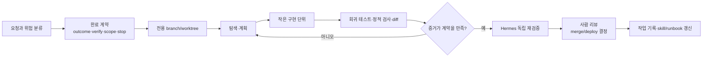

# Hermes Agent 개발 작업 워크플로우: 실전 사례 기반 심층 조사

기준 시점: 2026-07-26 KST
대상: NousResearch Hermes Agent v0.19.0 / 이 저장소의 기본 원격 Mac

## 결론

Hermes Agent를 개발에 가장 잘 쓰는 방식은 **“혼자 코드를 끝까지 자율 생성하는 봇”이 아니라, 요구사항·격리·구현 워커·검증 증거·사람 리뷰를 묶는 감독자(control plane)** 로 두는 것이다.

권장 기본 루프는 다음과 같다.



핵심 운영 규칙은 간단하다.

1. 한 작업은 한 **완료 계약**을 가진다.
2. 쓰기 작업은 반드시 한 **전용 worktree/branch**에서 한다.
3. 복잡한 구현은 Hermes가 직접 다 하기보다 **격리된 구현 워커**에 맡기고 Hermes가 diff와 테스트를 다시 확인한다.
4. “완료했다”는 문장보다 **실행된 검증 명령과 결과**를 신뢰한다.
5. 코드·운영·배포 변경은 항상 `review-required`로 끝내고, merge와 배포는 사람 결정으로 남긴다.

Hermes v0.19.0은 이 모델을 뒷받침한다. `/goal` 완료 계약, `hermes -w` worktree, checkpoint, background subagent, verification evidence, durable Kanban을 제공한다. 다만 공식 구현도 verification ledger를 보증이 아닌 수동적 증거라고 명시하며, verify-on-stop은 새 설치에서 기본 off다. 따라서 자동 기능만 켠다고 안전한 개발 프로세스가 완성되지는 않는다. [v0.19.0 release](https://github.com/NousResearch/hermes-agent/releases/tag/v2026.7.20), [verification evidence PR](https://github.com/NousResearch/hermes-agent/pull/52285), [verify-on-stop default PR](https://github.com/NousResearch/hermes-agent/pull/53552)

## 현재 환경 진단

2026-07-26 원격 점검 결과:

| 항목 | 관찰 | 판단 |
|---|---|---|
| Hermes | v0.19.0, upstream보다 119 commits 뒤 | 기능 기준은 최신 minor와 일치하나 업데이트는 별도 검토 필요 |
| Gateway | default + 4개 named profile 실행 | 역할 분리 기반은 준비됨 |
| Default model | `openai/gpt-5-nano` on custom provider | 복잡한 개발 감독 권한을 주기 전 repo-specific eval 필요 |
| Checkpoints | default/product/jarvis에 활성화한 운영 기록 | 복구 보조 수단으로 유효 |
| Kanban | 현재 0 tasks | 아직 실제 개발 control plane으로 쓰이지 않음 |
| Antigravity | CLI와 artifact root 존재, settings/MCP config missing | 현재 상태를 ready로 간주하면 안 됨 |
| Canonical repo | `main`에 다수의 기존 dirty/untracked 파일 | 직접 작업 금지, 새 worktree 필수 |

이 결과 때문에 이 조사 문서 자체도 원격 `main`을 건드리지 않고 `codex/research-hermes-dev-workflow-20260726` worktree에 작성했다.

## 권장 개발 워크플로우

### 0. Preflight: 도구보다 작업 경계를 먼저 확인한다

모든 작업 시작 전에 다음을 확인한다.

- 목표 repo와 실행 host
- 현재 branch 및 dirty state
- AGENTS.md / HERMES.md의 프로젝트 규칙
- 사용 가능한 test, lint, typecheck, build 명령
- 외부 시스템, 데이터, 비용, 인증, 배포에 미치는 영향
- 작업이 단일 수정인지, 장기 goal인지, 병렬 pipeline인지

Hermes는 시작 위치와 탐색한 하위 디렉터리에 따라 AGENTS.md를 점진적으로 불러온다. 따라서 프로젝트 루트에는 공통 규칙, 하위 디렉터리에는 해당 모듈의 검증 명령과 금지사항을 두는 것이 좋다. [Context Files](https://github.com/NousResearch/hermes-agent/blob/v2026.7.20/website/docs/user-guide/features/context-files.md)

### 1. 요청을 completion contract로 바꾼다

“로그인 버그 고쳐줘”가 아니라 다음 다섯 필드를 고정한다.

| 필드 | 질문 |
|---|---|
| outcome | 사용자 관점에서 무엇이 달라져야 하는가? |
| verification | 어떤 명령·테스트·artifact가 완료를 증명하는가? |
| constraints | 무엇을 깨뜨리면 안 되는가? |
| boundaries | 어느 repo·경로·도구만 건드릴 수 있는가? |
| stop_when | 어떤 상황이면 추측하지 말고 사람에게 돌려야 하는가? |

Hermes 공식 `/goal`도 이 다섯 요소를 completion contract로 사용하고, judge가 concrete evidence를 기준으로 판단하도록 한다. 기본 turn budget은 20이며 false positive/negative 가능성을 공식 문서가 명시한다. [Persistent Goals](https://github.com/NousResearch/hermes-agent/blob/v2026.7.20/website/docs/user-guide/features/goals.md)

실전 템플릿:

```text
Outcome:
- 사용자가 재현한 <증상>이 사라지고 기존 API 동작은 유지된다.

Verification:
- <targeted regression test>
- <module test suite>
- <lint/typecheck/build>
- git diff --check

Constraints:
- API response/schema 불변
- migration, secret, deployment 설정 변경 금지

Boundaries:
- repo: <absolute path>
- files: <allowed paths>

Stop when:
- DB schema 또는 외부 API 계약 변경이 필요함
- 인증/키/운영 재시작이 필요함
- 같은 blocker가 반복됨
```

긴 작업에는 `/goal draft ...`를 쓰되, 생성된 계약을 사람이 한 번 읽고 좁힌 뒤 시작한다. 짧은 1~2 파일 수정에는 `/goal` loop가 오히려 비용과 과잉 변경을 늘릴 수 있어 일반 one-shot + 명시적 검사면 충분하다.

### 2. 변경은 worktree에서 격리한다

공식 문서는 동일 checkout의 여러 agent가 서로 파일을 지우거나 덮을 수 있다고 경고하며, 한 실험당 하나의 worktree를 권장한다. `hermes -w`는 `.worktrees/` 아래에 독립 branch를 자동 생성한다. [Git Worktrees](https://github.com/NousResearch/hermes-agent/blob/v2026.7.20/website/docs/user-guide/git-worktrees.md)

```bash
cd /path/to/repo
hermes -w
```

공식 문서에는 다음 one-shot 예제가 있지만, 현재 설치에서는 사용하지 않는다.

```bash
hermes -w -z "완료 계약을 붙인 작업 지시"
```

2026-07-19 open P2 issue #67458은 `-z` one-shot 경로가 `-w`를 무시해 변경과 commit이 live `main`에 들어간 사례를 보고한다. 이번 조사에서 설치된 원격 source를 읽어 보아도 `_run_and_exit_oneshot()`이 `worktree`를 `run_oneshot()`에 전달하지 않는 형태였다. [Issue #67458](https://github.com/NousResearch/hermes-agent/issues/67458)

안전한 one-shot은 사람이 먼저 worktree를 만들고 경로를 확인한 뒤 그 안에서 실행한다.

```bash
git worktree add -b codex/task-name /absolute/path/to/task-worktree HEAD
cd /absolute/path/to/task-worktree
git rev-parse --show-toplevel
git status --short --branch
hermes -z "완료 계약을 붙인 작업 지시"
```

운영 규칙:

- dirty `main`에서는 agent를 실행하지 않는다.
- 구현 워커마다 별도 worktree를 준다.
- checkpoint는 worktree 안의 보조 복구 수단으로만 쓴다.
- dirty worktree는 자동 삭제하지 말고 review artifact로 남긴다.
- merge, push, deploy는 구현 worker에게 맡기지 않는다.
- 명령 flag가 격리를 보장한다고 가정하지 말고 root, branch, status를 증거로 남긴다.

Checkpoint는 파일 도구와 파괴적 명령 전 shadow git snapshot을 만들지만 실제 repository history와 독립적이다. 그러므로 branch/worktree를 대체하지 않는다. [Checkpoints and rollback](https://github.com/NousResearch/hermes-agent/blob/v2026.7.20/website/docs/user-guide/checkpoints-and-rollback.md)

### 3. 역할을 분리한다

권장 역할:

| 역할 | 책임 | 하지 않는 일 |
|---|---|---|
| Human | 우선순위, HIL 승인, merge/deploy | 반복적인 코드 탐색 |
| Hermes supervisor | 계약, 분해, context 전달, diff/검증 재실행, handoff | 구현 결과를 무검증 수용 |
| Implementation worker | 제한된 worktree에서 코드와 테스트 작성 | auth/config/merge/deploy |
| Verifier | acceptance criteria 기준 독립 검사 | 구현 의도에 맞춰 기준 완화 |

작업이 작으면 Hermes가 supervisor와 implementer를 겸해도 된다. 다중 파일, 병렬 조사, 별도 전문성이 필요한 일은 child agent 또는 외부 coding worker로 분리한다.

Subagent는 부모 대화와 이전 tool call을 전혀 모른다. 따라서 “그 오류를 고쳐라”가 아니라 repo, 실패 입력, 허용 파일, 검증 명령, 금지 행동까지 전달해야 한다. [Subagent Delegation](https://github.com/NousResearch/hermes-agent/blob/v2026.7.20/website/docs/user-guide/features/delegation.md)

### 4. 병렬화는 독립성 기준으로만 한다

좋은 병렬 작업:

- 서로 다른 모듈의 read-only 조사
- 독립된 테스트 실패 원인 분석
- 구현과 별도의 회귀 테스트 설계
- 보안·성능·API 호환성의 독립 리뷰

나쁜 병렬 작업:

- 같은 파일을 여러 worker가 동시에 수정
- 한 worker의 schema 결정이 나와야 다른 worker가 구현 가능한 작업
- provider quota를 무시한 대규모 fan-out
- 부모 대화를 전달하지 않은 채 “알아서 구현”

공개 이슈에는 단일 delegation model과 낮은 concurrency 한도로 429가 발생했다는 사용자 보고가 있다. 이 사례는 독립 검증된 benchmark는 아니지만, 병렬도와 모델을 “가능한 최대”로 잡지 말아야 한다는 운영 신호다. [Issue #18591](https://github.com/NousResearch/hermes-agent/issues/18591)

### 5. 구현 loop는 “재현 → RED → 최소 수정 → GREEN”으로 돌린다

권장 순서:

1. 실제 실패 입력, 로그, state를 읽기 전용으로 확보한다.
2. 실패를 한 문장과 한 재현 테스트로 축소한다.
3. 테스트가 수정 전 실패하는지 확인한다.
4. 가장 좁은 경계를 수정한다.
5. targeted test를 통과시킨다.
6. module/full checks로 회귀를 찾는다.
7. diff를 읽고 task scope 밖 변경을 제거한다.

중요한 점은 agent의 설명이 아니라 실패에서 성공으로 바뀐 증거다. Hermes v0.18+의 verification ledger도 foreground test/lint/typecheck/build 결과를 저장하고, 이후 파일이 수정되면 이전 증거를 stale로 만든다. 이 설계는 “테스트를 한 번 통과한 뒤 코드를 또 바꾸고 완료라고 말하는” 오류를 줄인다. [PR #52285](https://github.com/NousResearch/hermes-agent/pull/52285)

### 6. 검증은 네 층으로 쌓는다

| 층 | 목적 | 예시 |
|---|---|---|
| L1 targeted | 정확한 버그가 고쳐졌는지 | 단일 regression test |
| L2 module | 인접 동작 회귀 | unit/integration suite |
| L3 repository | 규칙과 빌드 | lint, typecheck, build, diff check |
| L4 environment | 실제 환경 차이 | read-only smoke, no-send dry run, process/status |

Hermes의 `pre_verify` hook은 완료 직전 사용자 정의 검사를 추가할 수 있지만, built-in verification을 대체하지 않는다. 또한 자동 nudge는 무한 반복하지 않도록 기본 최대 3회로 제한된다. [PR #55413](https://github.com/NousResearch/hermes-agent/pull/55413)

권장 completion evidence:

```text
- changed files
- exact commands run
- pass/fail counts
- relevant output excerpt or artifact path
- remaining warnings and pre-existing failures
- branch/worktree
- rollback/backup path when operations changed
- completion mode
```

### 7. 완료는 `done`과 `review-required`를 분리한다

다음은 `review-required`:

- code 또는 shell script 변경
- remote config, gateway, launchd, permissions
- auth/key/provider 변경
- recurring automation
- repository 생성, deployment setup
- delegated implementation
- 실제 merge나 운영 적용이 남은 작업

`done`은 read-only 진단이나 report-only 조사처럼 사람이 적용 결정을 할 변경이 없을 때만 사용한다.

### 8. 반복 성공만 skill/runbook으로 승격한다

한 번 성공한 prompt를 즉시 “표준”으로 만들지 않는다. 다음 조건을 만족할 때만 skill 또는 runbook으로 승격한다.

- 서로 다른 두 작업 이상에서 재사용됨
- 입력·출력·실패 조건이 명확함
- secret 또는 특정 host 값이 박혀 있지 않음
- verification command가 포함됨
- rollback과 human gate가 정의됨

## 리얼 사례 1: Jarvis Messenger Assistant

이 저장소의 2026-07-19~20 기록은 가장 강한 실제 사례다. 단순 데모가 아니라 macOS KakaoTalk, Discord control surface, Hermes gateway, launchd poller가 결합된 운영 자동화였다.

### 진행

- 최초 구현: 6 files, 2,338 insertions
- Jarvis-direct MCP refactor: 5 files, +367/-284
- routing/polling hardening: 5 files, +805/-81
- unit test는 기능이 확장되며 15개에서 60개로 증가
- 각 운영 변경마다 원격 backup, process 재시작 범위, cursor/state, live smoke를 기록

### 실제로 터진 문제

1. 사용자가 “비빔밥..?”이라고 했는데 오래된 하남 날씨 문맥을 우선해 잘못 답했다.
2. 새 KakaoTalk message가 없는데 이전 identical event를 근거로 send audit가 만들어졌다.
3. `launchd StartInterval=80`이 실제 약 120초로 coalesce되어 정확한 80초 polling을 보장하지 못했다.
4. Hermes의 PID 파일 형식 변화로 기존 parser가 `invalid`를 반환했다.
5. 큰 MCP response가 115 KB까지 늘어 Hermes에서 truncate됐다.
6. model이 요구한 send tool을 0회 또는 2회 호출해도 자연어 결과만 보면 성공으로 오판할 수 있었다.

### 어떻게 해결했나

- 현재 turn만으로 intent를 잠그고, 과거 context는 답변 drafting 단계에만 제공했다.
- tool name별 call/result count를 정확히 검증했다.
- trigger timestamp 이후의 실제 outgoing event를 확인하도록 send verification boundary를 강화했다.
- `StartInterval`을 버리고 monotonic deadline 기반 persistent loop로 바꾼 뒤 실제 80초 간격을 관찰했다.
- old/new PID shape 모두를 처리하는 RED regression test를 추가했다.
- MCP response 크기를 bounded input으로 줄이고 truncated/malformed 결과는 fail-closed 처리했다.
- unit/compile/OKF/diff checks 뒤 원격 no-send 또는 read-only smoke를 별도로 수행했다.

### 배운 점

- 가장 위험한 버그는 syntax가 아니라 **context, state, side-effect verification의 경계**에서 생겼다.
- production trace를 test fixture로 바꾸는 속도가 agent의 코드 생성 속도보다 중요했다.
- 자동화는 confidence가 높아도 send 대상·신선도·tool evidence를 deterministic guard로 확인해야 했다.
- recurring automation은 테스트가 모두 통과해도 `review-required`가 맞다.

근거: `tasks/2026-07-19-jarvis-messenger-assistant.md`, commits `c033465`, `8a5f40f`, `898193e`.

## 리얼 사례 2: Hermes upstream의 “완료 증거” 도입

Hermes 프로젝트 자체도 agent가 “고쳤다”고 말하는 것과 실제 검증이 다르다는 문제를 겪었다.

Merged PR #52285는:

- canonical test/lint/typecheck/build 명령을 감지
- evidence를 session/workspace별 SQLite ledger에 기록
- full/targeted와 pass/fail을 구분
- 파일 수정 후 기존 evidence를 stale로 표시
- storage 크기와 retention을 제한

PR 설명은 이 기능이 **기록이지 보증이 아니다**라고 명시한다. 이후 PR #55413은 사용자 정의 `pre_verify` hook을 추가했고, PR #53552는 과도한 자동 nudge 때문에 verify-on-stop을 새 설치에서 default off로 바꾸고 doc-only changes를 제외했다.

여기서 얻는 실무 결론은 “검증을 무조건 자동화”가 아니다. **변경 유형별 검증 계약을 명시하고, 결과를 기록하며, 필요할 때만 agent loop를 계속시키는 것**이다.

## 리얼 사례 3: Delegation이 coordinator로 진화한 과정

2026-04 공개 이슈 #11508은 `delegate_task`가 동기 blocking이라 coordinator가 child를 기다리는 동안 새 사용자 메시지를 받을 수 없다고 보고했다. 2026-07 v0.19.0에서는 top-level delegation이 background handle을 반환하고, child 결과가 나중에 원 conversation으로 재진입한다. 또한 merged PR #67479는 child별 live transcript와 7-day retention을 추가했고, PR #63494는 background completion delivery를 durable하게 만들었다. [Issue #11508](https://github.com/NousResearch/hermes-agent/issues/11508), [PR #67479](https://github.com/NousResearch/hermes-agent/pull/67479), [PR #63494](https://github.com/NousResearch/hermes-agent/pull/63494)

그러나 다음 한계는 남는다.

- child는 부모 대화를 모른다.
- orchestrator child는 자신의 worker 결과를 합성하기 위해 기다린다.
- 실행 도중 process가 재시작되면 side effect를 증명할 수 없어 attempt가 unknown일 수 있다.
- 오래 살아야 하는 작업은 in-process delegation보다 Kanban, cron, 별도 worker가 낫다.

즉 `delegate_task`는 **한 conversation 안의 reasoning fan-out**, Kanban은 **재시작과 handoff를 견뎌야 하는 durable workflow**로 구분해야 한다.

## 리얼 사례 4: 하루 8시간 production 개발이 보여 준 양면

2026-04 closed P1 issue #5563의 사용자는 3주간 하루 8시간 이상 Hermes와 Claude Opus로 DBOS, PostgreSQL, S3, Gmail API 기반 3-actor email processing pipeline을 개발했고, Hermes가 일관되게 결과를 냈다고 보고했다. 이는 단순 데모가 아니라 복잡한 multi-service production coding에 Hermes가 실제 사용됐다는 강한 현장 증거다. [Issue #5563](https://github.com/NousResearch/hermes-agent/issues/5563)

동시에 같은 보고는 장기 단일 session의 비용과 신뢰성 문제를 수치로 제기했다.

- 사용자는 약 12시간 session의 약 2.6M tokens 중 69%를 context replay overhead로 귀속
- 한 conversation은 약 1.9M tokens 중 89%가 불필요한 replay였다고 사용자 추정
- state.db corruption 뒤 128 sessions 중 110개만 DB로 복구
- 700K+ context 뒤 실제 local WSL2 환경을 cloud container로 오인

반대 증거도 있다. maintainer는 issue를 닫으면서 여러 파일이 silent session fragmentation이 아니라 growing session snapshots와 repeated resume signature라며 69%/89%의 **원인 해석을 부정**했다. state.db에는 auto-repair와 `hermes db repair`가 추가됐고, WSL 환경 오인은 host block/env probe로 상당 부분 보강됐다고 설명했다. 따라서 이 수치를 Hermes의 확정된 replay overhead로 인용하면 안 된다.

이 사례는 v0.6.0+ 시절의 사용자 자기보고와 maintainer 반론을 함께 봐야 한다. 그래도 장기 작업을 **작업별 bounded goal, worktree, artifact handoff, 새 verifier context**로 나누고 usage/session health를 관찰해야 한다는 운영 결론은 유효하다.

## 리얼 사례 5: 공개된 실패·near-miss가 보여 주는 운영 경계

다음은 모두 NousResearch 공식 issue tracker의 field report다. maintainer가 모든 환경에서 재현한 독립 benchmark가 아니므로 항상 발생한다고 일반화하면 안 된다. 그러나 구체적 환경·명령·로그를 제시하므로 production gate 설계에 유용하다.

| 사례 | 실제 관찰 | 워크플로우에 반영할 guard |
|---|---|---|
| shared session/worktree #46303 | 두 동시 session의 memory가 섞이고 같은 branch/worktree를 공유해 clobber 직전 수동 중단 | 한 project의 active writer는 worktree별 1 session, 시작 시 owner/branch/status 확인 |
| one-shot worktree #67458 | `hermes -z ... -w`가 flag를 무시하고 live `main`에 commit | manual worktree 또는 interactive `hermes -w`; root/branch 증거 필수 |
| headless Kanban runtime #63351 | source edit 성공 후 TMPDIR, network, git index.lock, 승인 부재로 install/stage/commit 실패 | cold dependency와 git metadata write를 pilot에서 검증; block을 정상 handoff로 취급 |
| subagent summary #58490 | verify-on-stop이 child의 실제 결과를 마지막 검증 문구로 대체 | parent가 live transcript, diff, test를 직접 회수; child summary 단독 수용 금지 |
| custom provider #59386 | strict OpenAI-compatible proxy에서 delegation schema HTTP 400이 6 sessions/9회 발생 | custom provider마다 read-only delegation smoke test 후 toolset 활성화 |
| short-lived parent #71453 | v0.19.0 `hermes chat -q`가 async child를 띄운 뒤 CLI 종료 시 interrupt | delegation은 지속 gateway/interactive session에서 실행; `chat -q` 금지 |

근거: [#46303](https://github.com/NousResearch/hermes-agent/issues/46303), [#67458](https://github.com/NousResearch/hermes-agent/issues/67458), [#63351](https://github.com/NousResearch/hermes-agent/issues/63351), [#58490](https://github.com/NousResearch/hermes-agent/issues/58490), [#59386](https://github.com/NousResearch/hermes-agent/issues/59386), [#71453](https://github.com/NousResearch/hermes-agent/issues/71453)

공통점은 모델 추론보다 **실행 surface의 lifetime, filesystem boundary, provider schema, session ownership**에서 실패했다는 것이다. 그래서 좋은 Hermes 개발 프로세스는 prompt engineering보다 runtime preflight와 evidence handoff에 더 많은 규칙을 둬야 한다.

## 작업 규모별 선택

| 상황 | 권장 방식 |
|---|---|
| 1~2 파일, 명확한 수정 | interactive `hermes -w`, 또는 manual worktree 안의 one-shot + targeted/module checks |
| 여러 단계의 refactor | `/goal` completion contract + worktree + turn budget |
| 독립된 조사/리뷰 2~3개 | background `delegate_task` + 명시적 context |
| 여러 구현 lane | lane별 worktree + Hermes supervisor |
| 의존성 있는 장기 pipeline | Kanban: decompose → implement → verifier → synthesizer |
| 반복 운영 자동화 | deterministic script/controller + Hermes 판단 seam + HIL |
| auth/config/deploy | 별도 승인, backup, `review-required` |

Hermes Kanban은 SQLite-backed durable board에서 작업, dependency, heartbeat, retry, worktree를 관리하고, 공식 문서는 engineering pipeline을 “decompose → parallel worktrees → review → iterate → PR”로 설명한다. 다만 dashboard를 `0.0.0.0`에 열면 plugin route가 노출될 수 있으므로 localhost binding을 유지해야 한다. [Kanban docs](https://github.com/NousResearch/hermes-agent/blob/v2026.7.20/website/docs/user-guide/features/kanban.md)

## 이 환경에 바로 적용할 제안

### 1단계: 단일 lane을 표준화

- 개발 profile 하나를 정한다.
- 모든 write task는 `hermes -w`.
- AGENTS.md에 canonical test/lint/typecheck/build를 적는다.
- task note에 completion contract와 evidence 표를 남긴다.
- merge/deploy는 사람이 한다.

### 2단계: supervisor/worker 분리

- 2~3개 대표 작업으로 구현 worker를 평가한다.
- repo path, worktree, allowed files, tests를 context에 강제한다.
- Hermes가 worker 결과를 받은 뒤 같은 검증 명령을 독립 재실행한다.
- 현재 Antigravity 경로는 settings/MCP config가 missing이므로 readiness 복구 전 사용하지 않는다.
- 현재 provider가 custom endpoint이므로 read-only `delegate_task` schema smoke test를 통과하기 전 delegation toolset을 켜지 않는다.

### 3단계: Kanban pilot

세 카드로만 시작한다.

1. Implement: 격리 worktree에서 수정
2. Verify: acceptance criteria와 diff 검토
3. Human review: merge 여부 결정

5~10개 작업에서 retry, provider limit, 비용, human intervention 비율을 측정한 뒤 병렬도를 늘린다.

### 4단계: repo-specific eval

현재 default profile은 `gpt-5-nano`다. 모델 이름만 보고 자동화 수준을 결정하지 말고 다음 지표를 비교한다.

- 첫 시도 targeted test 통과율
- scope 밖 변경 비율
- tool-call/schema 오류율
- 사람 review에서 reject된 비율
- 평균 비용과 wall time
- 동일 회귀 재발률

복잡한 개발 감독 권한은 이 eval을 통과한 profile에만 준다.

## 피해야 할 안티패턴

- dirty `main`에서 agent 여러 개 실행
- “알아서 고쳐”처럼 verification 없는 goal
- child에게 부모 conversation이 전달된다고 가정
- test 한 번 통과 후 추가 수정하고 재검증 생략
- checkpoint를 git branch나 backup으로 오해
- model confidence만으로 외부 side effect 실행
- agent가 만든 summary를 diff/test 대신 신뢰
- provider quota를 무시한 최대 fan-out
- script/config/deploy 작업을 `done`으로 보고
- `--yolo`를 운영 기본값으로 사용
- `hermes -z ... -w`의 flag만 믿고 root/branch 확인을 생략
- `hermes chat -q`에서 background delegation 실행

## 최종 판단

Hermes Agent의 개발 가치는 단일 coding model의 성능보다 **지속적인 작업 운영**에 있다. gateway에서 요청을 받고, profile과 skill로 맥락을 유지하며, worktree와 delegation으로 실행을 격리하고, goal/Kanban으로 계속성을 만들며, verification evidence와 human gate로 완료를 통제할 수 있다.

이 환경에서는 다음 한 줄이 가장 현실적인 표준이다.

> **사람이 outcome과 위험을 승인하고, Hermes가 계약·분해·검증을 소유하며, 구현 워커는 격리 worktree에서만 수정하고, 테스트·diff·운영 증거가 있는 결과만 review-required로 넘긴다.**

## 조사 한계

- 공식 release의 성능 수치는 NousResearch 자체 발표이며 독립 benchmark가 아니다.
- 공개 이슈는 실제 사용자 보고지만 모든 환경에서 재현된 것은 아니다.
- Jarvis 사례는 이 저장소와 특정 macOS 환경의 결과다.
- 이번 조사는 workflow 설계이며 특정 모델의 우열을 측정하지 않았다.

## 산출물

- Brief: `research/briefs/2026-07-26-hermes-development-workflow.md`
- Source ledger: `research/sources/2026-07-26-hermes-development-workflow.jsonl`
- Notes: `research/notes/2026-07-26-hermes-development-workflow.md`
- Report: `reports/2026-07-26-hermes-development-workflow.md`
